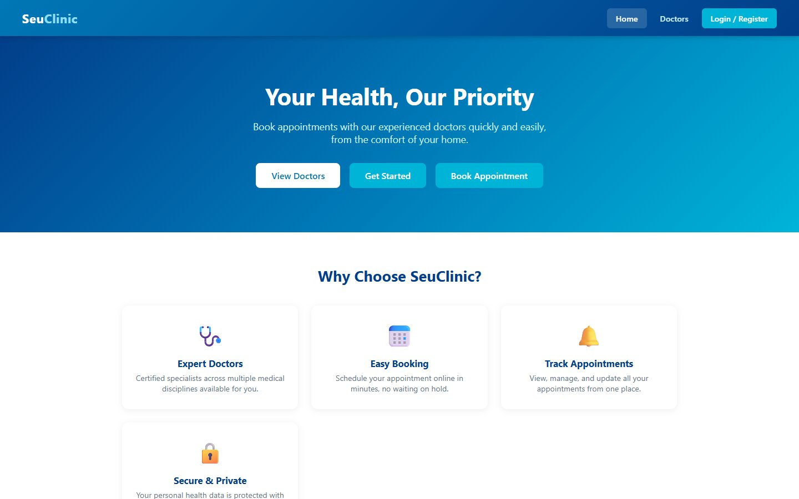
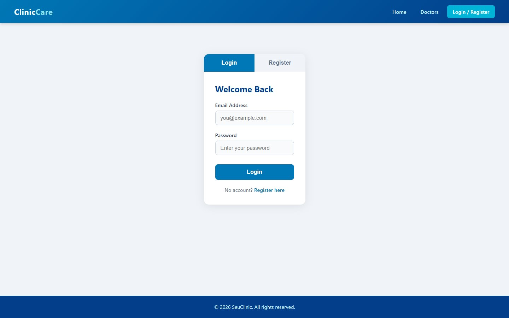

# SeuClinic — clinic appointment system (PHP + MySQL)

A server-rendered web application where patients can register, browse the clinic's doctors, **book appointments**, and manage their bookings. Built with plain PHP, PDO and MySQL, and run locally on XAMPP.

*University project.*



## Features

- **Accounts:** register and log in (session-based), with client-side form validation
- **Doctors:** six doctors across General Medicine, Cardiology, Dermatology, Pediatrics, Orthopedics and Neurology, each with a "Book" shortcut
- **Booking:** choose a doctor, a date (no past dates) and a time within clinic hours (08:00–17:00)
- **My Appointments:** see all your bookings, newest first; update their status or delete them (with a confirmation prompt)
- **Security basics:** every query uses **PDO prepared statements**, output is escaped with `htmlspecialchars`, and users can only read or change their own appointments (`WHERE user_id = ?`)

| Login / Register |
|---|
|  |

## Database

```sql
users        (id, name, email UNIQUE, password, created_at)
appointments (id, user_id → users.id ON DELETE CASCADE, doctor, specialty,
              date, time, status DEFAULT 'Pending', created_at)
```

`clinic.sql` creates the `clinic_db` database, both tables, and some sample data.

## Run locally (XAMPP)

1. Install [XAMPP](https://www.apachefriends.org/) and start **Apache** and **MySQL**.
2. Copy this folder into `htdocs`, e.g. `C:\xampp\htdocs\clinic`.
3. Open **phpMyAdmin** (http://localhost/phpmyadmin) → **Import** → choose `clinic.sql`.
4. Visit http://localhost/clinic/.

Connection settings are in `db.php` (defaults: host `localhost`, user `root`, empty password, database `clinic_db`).

**Sample logins:** `ali@example.com` / `123456` · `sara@example.com` / `123456`

## Project structure

```
clinic/
├── index.php      home page
├── auth.php       login / register / logout
├── doctors.php    doctor list
├── book.php       booking form (login required)
├── history.php    my appointments: list, update status, delete (login required)
├── db.php         PDO connection
├── clinic.sql     schema + sample data
├── script.js      tab switching and form validation
└── style.css      styles
```

## Known limitations

This was built for learning. Before using anything like it for real:

- Passwords are hashed with **MD5**. Switch to `password_hash()` / `password_verify()`.
- Forms have no CSRF tokens.
- Patients can set their own appointment status. In a real clinic, only staff should confirm appointments.

## Tech stack

PHP · MySQL / MariaDB · PDO · HTML · CSS · JavaScript · XAMPP

---

Built by **Abdullah Bokhary** · [Portfolio](https://abdullah.pageui.workers.dev/) · [LinkedIn](https://www.linkedin.com/in/abdullah-bokhary-840315326/) · [GitHub](https://github.com/abdullah2036)
